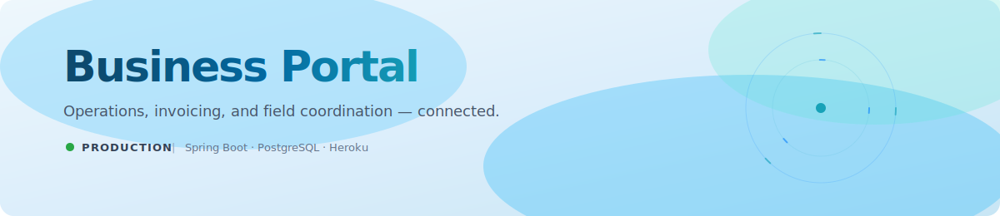

  
  &nbsp;
  
  &nbsp;
  

 

## Executive summary

A contract client needed to replace fragmented, manual processes with a single system connecting **vendors, dealers, contractors, and office staff**. I designed, built, and delivered a full-stack operations platform covering user administration, work-order management, invoicing, and field coordination — and I continue to operate the production environment today.

| | |
| :-- | :-- |
| **Engagement type** | Contract — design, build, deploy, maintain |
| **Status** | In production, actively maintained |
| **Platform** | Web application, responsive across desktop and mobile |
| **Infrastructure** | Heroku with managed PostgreSQL |

 

## Platform metrics

<table>
  <tr>
    <td align="center">
      
       Server-rendered pages via Thymeleaf — no SPA boot cycle
    </td>
    <td align="center">
      
       Work orders, invoicing, and user admin in one system
    </td>
    <td align="center">
      
       One PostgreSQL database replaces fragmented records
    </td>
  </tr>
  <tr>
    <td align="center">
       
      
       Maps, tap-to-call, and job lists for crews on site
    </td>
    <td align="center">
       
      
       Back-office search, batch actions, and record management
    </td>
    <td align="center">
       
      
       Distinct views for installers, dealers, vendors, and staff
    </td>
  </tr>
</table>

 

 

## Capabilities

| Domain | Delivered functionality |
| :-- | :-- |
| **Access control** | Secure role-based authentication with distinct permissions for installers, dealers, vendors, and office staff |
| **Work-order management** | Full lifecycle — creation, assignment, status updates, and completion tracking |
| **Invoicing** | Dedicated invoice builder with tracking from creation through payment |
| **Field enablement** | Integrated maps, tap-to-call phone numbers, and one-tap email for teams on site |
| **Collaboration** | Shared notes connecting field crews with back-office staff |
| **Records & search** | Centralized PostgreSQL records with fast filtering and search |

 

 

## Architecture

| Layer | Rationale |
| :-- | :-- |
| **Application** | Java and Spring Boot provide a mature, type-safe foundation suited to long-term maintenance |
| **Presentation** | Thymeleaf SSR with JavaScript and jQuery delivers fast first paint and broad device compatibility |
| **Data** | PostgreSQL enforces relational integrity across users, orders, and invoices |
| **Operations** | Heroku keeps deployment and hosting overhead low for the client |

 

 

## Product tour

<table align="center">
  <tr>
    <td align="center">
      
        
      
       
      Relational schema underpinning users, jobs, work orders, and invoicing
    </td>
  </tr>
</table>

 

<table align="center">
  <tr>
    <td align="center" width="50%">
      
        
      
       
      Role-based management of installers, dealers, and vendors
    </td>
    <td align="center" width="50%">
      
        
      
       
      Map view and job list for crews on the move
    </td>
  </tr>
  <tr>
    <td align="center" width="50%">
       
      
        
      
       
      Assignment, updates, and stage tracking in one record
    </td>
    <td align="center" width="50%">
       
      
        
      
       
      Invoice creation and monitoring, end to end
    </td>
  </tr>
</table>

 

## Engagement

**Scope.** Sole engineer across the full delivery: requirements, data modeling, application development, deployment, and ongoing production support.

**Outcome.** The client's daily operations — user administration, job dispatch, work orders, and billing — now run through one system with role-appropriate access for every party.

**Current state.** The platform is live on Heroku; I maintain the production environment and ship updates as the client's needs evolve.

---

**Business Portal** 
Contract engagement &nbsp;·&nbsp; In production on Heroku

